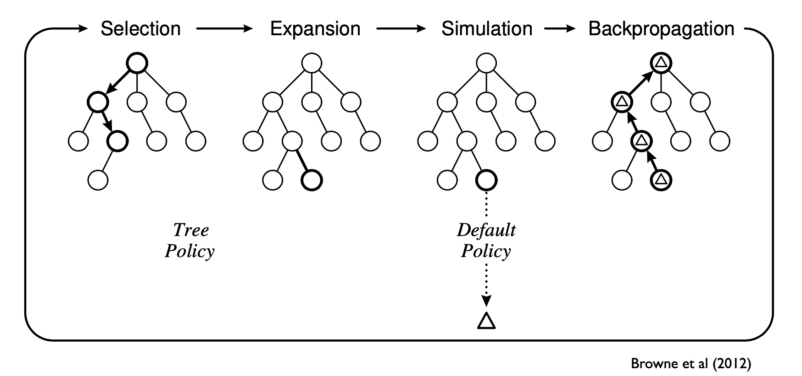

# Annotated Bibliography

This is an entry in the OEIS of the possible arrangements of n Connect Four pieces in a 7 by 6 board. Having learned about the OEIS earlier in our studies of Discrete Math, it was fun to know our project had its own entry! Used as background research.

<i>A090224 - OEIS</i>. <a href="https://oeis.org/A090224">https://oeis.org/A090224</a>. Accessed 12 Dec. 2020.

This is a classic paper which was one of the, if not the *the* first to declare Connect Four a solved game. It presents a Connect Four solution in which the first player always wins, at least, when they always place the right pieces. Interestingly, the best first move is to put a game piece in the middle column of the board because it presents the most streak options going forward in the game tree. We used the paper as background research.

Allis, Victor. “A Knowledge-Based Approach of Connect-Four: The Game Is Solved: White Wins.” <i>ICGA Journal</i>, vol. 11, no. 4, Dec. 1988, pp. 165–165. <i>DOI.org (Crossref)</i>, doi:<a href="https://doi.org/10.3233/ICG-1988-11410">10.3233/ICG-1988-11410</a>.

This appears to be a course lecture presentation. It simply presents an explanation of the MCTS method, its history, and contrasts it with other solving methods. Among game playing applications, it also presents MCTS as a way to improve productivity tools. It also includes a number of useful diagrams such as:

We utilized this paper as background research and for general approach.

Browne, Cameron. <i>Monte Carlo Tree Search</i>.

  

Cazenave, Tristan, and Abdallah Saffidine. “Score Bounded Monte-Carlo Tree Search.” <i>Computers and Games</i>, edited by H. Jaap van den Herik et al., vol. 6515, Springer Berlin Heidelberg, 2011, pp. 93–104. <i>DOI.org (Crossref)</i>, doi:<a href="https://doi.org/10.1007/978-3-642-17928-0_9">10.1007/978-3-642-17928-0_9</a>.

A paper connecting neural networks and the MCTS algorithm. Used as background research.

Faußer, Stefan, and Friedhelm Schwenker. “Neural Approximation of Monte Carlo Policy Evaluation Deployed in Connect Four.” <i>Artificial Neural Networks in Pattern Recognition</i>, edited by Lionel Prevost et al., Springer, 2008, pp. 90–100. <i>Springer Link</i>, doi:<a href="https://doi.org/10.1007/978-3-540-69939-2_9">10.1007/978-3-540-69939-2_9</a>.

The Wolfram Mathworld for Connect Four. We used this to find additional linked sources and as general background research.

Weisstein, Eric W. <i>Connect-Four</i>. Wolfram Research, Inc., <a href="https://mathworld.wolfram.com/Connect-Four.html">https://mathworld.wolfram.com/Connect-Four.html</a>. Accessed 12 Dec. 2020.

This paper details the Minimax algorithm conceptually in the context of the Connect Four game. We used this paper to inform our algorithm approach, optimizations, and for background knowledge. It uses a more complicated implementation of Minimax than we had time to develop and test, but the general structure is explained well in this paper.

Kerr, Wesley. “Connect Four and Effectiveness of Decision Trees.” <i>University of Wyoming</i>, p. 5.

A paper outlining and diagraming the MCTS approach for gaming applications, including tic tac toe game and other situations. We used this paper as an outline of the rough approach for our MCTS algorithm.

  
Fu, Michael C. “Monte Carlo Tree Search: A Tutorial.” <i>University of Maryland</i>, p. 15.

  

