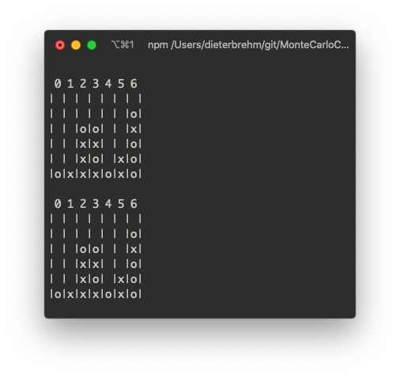

## Automated Four in a Row
***Explorations in Tree Searches  and Game Algorithms***
 
 

Hi There!

<SidePhoto>

We implemented and tested a <strong>Monte Carlo Tree Search</strong> algorithm that can successfully play Connect Four against a human player or another simulation.    In the process,  we learned about the logic behind the approach, trained our algorithm, and built an alternative minimax simulated player. In this website, we included our findings, research, and conclusions. Take a dive in the world of board game bots and connect four!

</SidePhoto>

### [Connect Four](connect-four/index.md)
 The Monte Carlo Tree Search algorithm determines the best move possible for our player given the results of many game situations. Each node in the tree represents a unique game state. For each potential move, the game plays multiple games, choosing random moves until a win/loss/draw is reached. The algorithm then backpropagates up the tree, updating values at each node depending on the outcome. The move to take on that turn is the one with the best win rate based on simulations.

<HeroButton to="/connect-four">Connect Four Gameplay</HeroButton>

### [Monte Carlo Tree Search](mcts/index.md)
The Monte Carlo Tree Search algorithm determines the vest move possible for our player given the results of many game situations. Each node in the tree represents a unique game state. For each potential move, the game plays multiple games, choosing random moves until a win/loss/draw is reached. The algorithm then backpropagates up the tree, updating values at each node depending on the outcome. The move to take on that turn is the one with the best win rate based on simulations.

<HeroButton to="/mcts">MCTS in Detail</HeroButton>

### [Minimax](minimax/index.md)
The Minimax Search Algorithm is a graph decision algorithm used, in this case, to offer move candidates for our connect four bot. Its name comes from its goal to minimize the score of its opponent while maximizing the bot score at every move made. In contrast to the MCTS, it doesn't play out the game tree entirely. 

<HeroButton to="/minimax">Minimax in Detail</HeroButton>

### [performance](performance/index.md)

<HeroButton to="/performance">More Performance Stats</HeroButton>

<!-- ### [discussion](discussion/index.md) -->

<!-- <HeroButton to="/discussion">Discussion in Depth</HeroButton> -->

### [bibliography](bibliography/index.md)

---
Made with ❤️ at Olin College. [source code](https://github.com/sdaitzman/MonteCarloConnoctFour)
