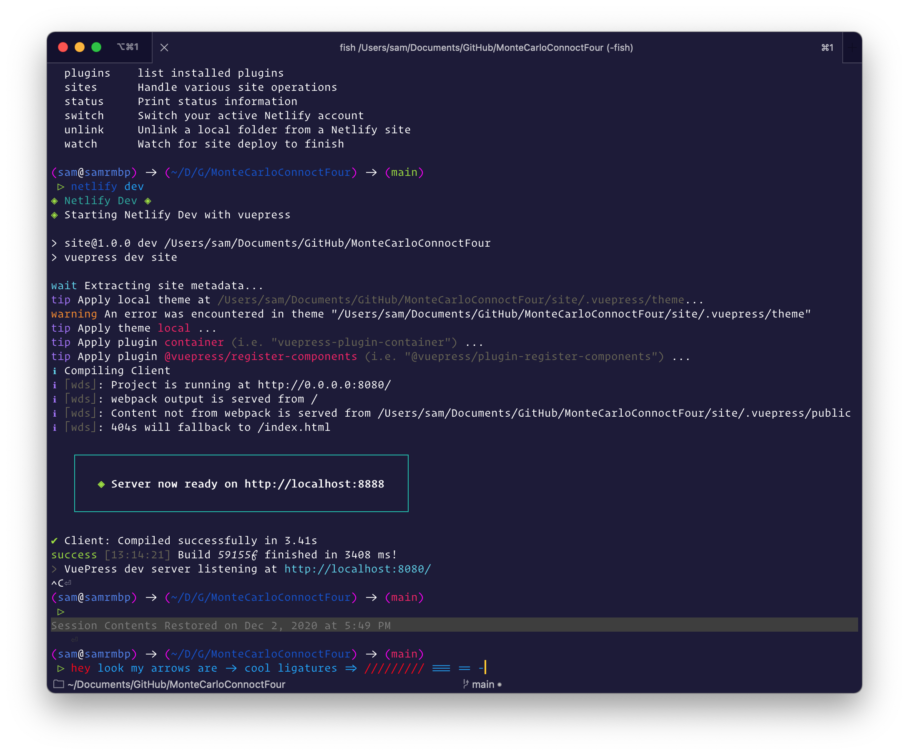

# Monte Carlo Connect Four

This is a website about Monte Carlo. It can also have [subpages](subpage/index.md).

Inline math: $\rho=\frac{m}{l*w*h}$ and block math:s

$$\frac {\partial^r} {\partial \omega^r} \left(\frac {y^{\omega}} {\omega}\right) 
= \left(\frac {y^{\omega}} {\omega}\right) \left\{(\log y)^r + \sum_{i=1}^r \frac {(-1)^i r \cdots (r-i+1) (\log y)^{r-i}} {\omega^i} \right\}$$

Some test code for syntax highlighting:
```C
void someFunction(int aNumber) {
    // a comment
    doSomething(aNumber);
}
```

An image:


<!-- Make sure these images are referenced with relative paths -->

Made with ❤️ at Olin College.