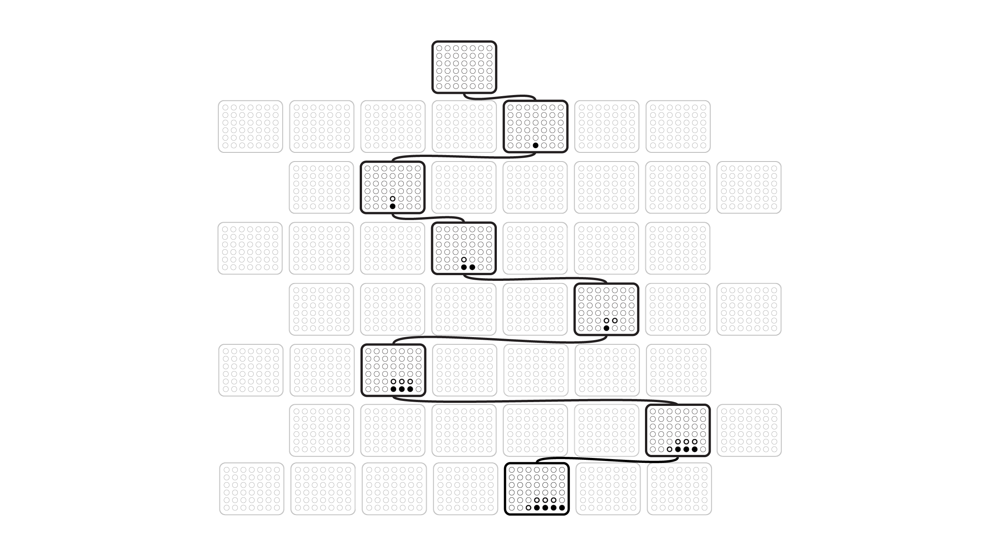

# Monte Carlo Tree Search 

# Game Tree

Each node in the game tree represents a configuration of pieces on the board. These nodes also store other relevant information, including the following:

1. The parent node (What was the previous move that led to this board configuration?)

2. Number of times this node has been visited

3. Number of times a winning game has occurred that had this game state

4. Possible moves to take

With this structure, the root node is the empty board at the beginning of the game, and edges represent potential board game states that can happen sequentially. Traversing from the top of the tree all the way to a leaf simulates a game being played. For our implementation, we assume that the 'x' piece always goes first, which means we can use the same tree to train both players.

Visually, we can represent it as:

Where we see a path being taken through the possible positions until a final outcome

# The Search

When it is the computer's turn to take a move, the algorithm determines the optimal move after playing out multiple games.

The computer follows the following steps during a game simulation until a terminal state is reached:

1. If the game space is familiar, ie. this state has been visited before and all possible moves have also been explored, then the "best" move is selected based on a formula that factors in the win rate and visit rate of each child node, or possible move.
2. If a node is reached that has child nodes that have yet to be visited, the algorithm will select a random one to visit and mark it as a visited node.
3. The computer will continue to play out the game, selecting random moves until a terminal state is reached.

We can consider this tree search as depth-based, which makes sense since a traversal down the tree from root to leaf is equivalent to a game playout. After the game is finished, and a winner is determined, the algorithm uses backpropagation (think of it as turning around and traversing back up the tree), updating each node by increasing the counter for visit count and, if the game resulted in a win, the algorithm will also increase the win counter.

Once the computer has played out multiple simulation games from the current spot, the computer then selects the move that has the highest win rate. In other words,

$$\text{best move} = \text{max}(x, \frac{\text{number of wins with }x\text{ move}}{\text{number of times }x\text{ is visited}})$$

At the very beginning, there are few nodes that exist, so more computational power is used on creating new nodes and finding a leaf, As more games are played, computational power will shift to  step 1.
