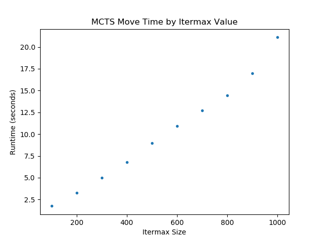

# Performance

## Implementation Decisions

We wanted to focus on learning how the Monte Carlo Tree Search (MCTS) and Minimax algorithms operated, so we decided to build our implementation off of an existing implementation of the game Connect Four. Our base code was from the University of Notre Dame.

We implemented these algorithms without the aid of machine learning libraries; we created our own Node() class to represent game states and wrote our own methods to train the computer. This enabled us to truly understand how these game trees are built and why they are effective.

The downside to these decisions was the fact that we had to investigate the existing Connect Four implementation and build upon its existing game logic.  By making implementation easier so that we could focus on understanding core concepts, we sacrificed overall performance of the computer players.

According to our research, with the MCTS algorithm, we would need to train our computer on at least 20,000 games for the computer to start having a higher than random winning rate.

In one game, there can be up to 42 different board states (all the way up to the entire board being filled). In comparison, there are over 4.5 trillion unique board arrangements in Connect Four given a standard 7x6 grid.  As the computer trains, more moves in the earlier stages of the game are recognized, while endgame positions continue to be explored.

Because the algorithm proceeds with a random playout of the game when a new node is reached, the time needed to train the computer is upwards of several hours. This is because a certain threshold of games must be hit for the majority of the computer's decisions to be based off of experience and rewards from winning rather than random exploration. With our implementation, which has not been optimized for performance, the training time required for the tree would likely take days.

The above graph visualizes the increase in runtime per move as a function of itermax (number of simulations). From the collected data, there is a linear relationship between itermax and runtime, but it could potentially be quadratic.

If we were to pursue this project in the future, we would need to decrease the runtime of the MCTS algorithm via code refactoring. We would also turn to existing machine learning python libraries, like PyTorch or Keras, to further optimize our code.

A dream would be for the computer to be trained enough such that it could compete well against a casual player. One sign of this would be that if the MCTS algorithm has the first move, it would always play the center column, which has been mathematically proven to be the best first move.
